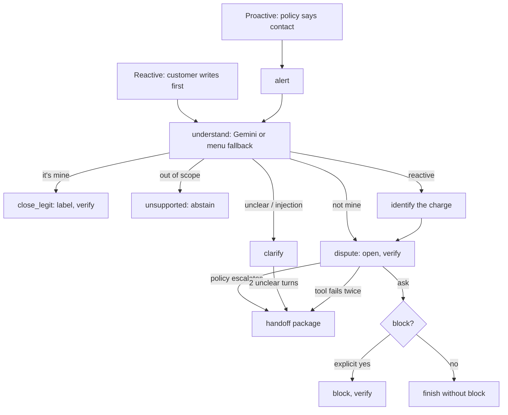

# Agent design

How Bianque talks to the customer and acts, and **why**. It runs after the model and the
policy: the model gives `p_fraud`, the policy decides whether to contact, and the agent runs
the conversation, the verified actions and the human handoff. Previous: [`model_design.md`](model_design.md);
policy: [ADR 0003](adr/0003-contact-policy-v1.md).

Code: [`agent/graph.py`](../src/bianque/agent/graph.py) (LangGraph state machine),
[`agent/tools.py`](../src/bianque/agent/tools.py) (permissions),
[`agent/session.py`](../src/bianque/agent/session.py) (identity),
[`agent/llm.py`](../src/bianque/agent/llm.py) (Gemini extraction),
[`agent/replies.py`](../src/bianque/agent/replies.py) (ES / PT templates),
[`agent/store.py`](../src/bianque/agent/store.py) (cases, audit),
[`api/conversations.py`](../src/bianque/api/conversations.py) (HTTP).

## 1. Who does what

| Piece | Does | Never |
|---|---|---|
| Model | Calibrated `p_fraud` with a credible interval | Decide |
| Policy (`contact_policy_v1.yaml`) | Contact or not, channel, human or Bianque, action requirements | Talk to the customer |
| Gemini | Message → validated JSON: intent, yes/no, language, amount, date, merchant, injection flag | Decide, call tools, see a `customer_id` or unmasked personal data, write replies |
| LangGraph state machine | The workflow; every node is deterministic code | Skip a step |
| Tools | Read and act, checking session, ownership and the policy's requirements | Act for another customer or without requirements |
| Templates | Replies in Spanish or Portuguese from verified values | State something not read back from the system |

## 2. The workflow

Each customer message is one run of the graph; the state of a conversation persists between
turns in a LangGraph checkpointer (thread = conversation).

### The three paths the brief requires

| Path | Example | Outcome |
|---|---|---|
| Normal automated resolution | "No fui yo" → "sí" | Verified dispute and provisional block; the reply quotes the case and block numbers read back from the store |
| Ambiguous or unsupported | "mmm no sé", "quiero un préstamo" | Clarify (after 2 unclear turns, hand off) or decline without acting |
| Human required | Dispute ≥ USD 5,000, repeat complainer, uncertain model, tool failure | Structured handoff routed by language and specialty |

## 3. Identity and permissions

- **Trusted test session.** Identity comes only from a signed, expiring token
  (HMAC-SHA256 with `SESSION_SECRET`, 15 minutes) sent as `Authorization: Bearer` with every
  request. A customer number or ID typed in the chat is not a session. `POST /test/sessions`
  stands in for the bank's app login and is labeled test-only.
- **Ownership in the tools.** A charge, case or block of another customer does not exist for
  a session: the tool raises `PermissionDenied` and the agent says it found nothing, without
  revealing whether it exists. Over HTTP, another customer's conversation is a 404.
- **Requirements in the tools.** `open_dispute` needs `authenticated_session` and
  `intent_not_mine`; the provisional block also needs `explicit_confirmation`. They come from
  the policy file and are checked in code, not in a prompt.

## 4. Verify before reporting

Every action is read back before the customer hears about it: `open_dispute` → `verify_case`,
`block_product` → `verify_block`, `close_as_legitimate` → label read back. Replies are
templates filled with those values ([ADR 0004](adr/0004-agent-replies-from-templates.md)), so
a reply cannot state an action that did not happen.

## 5. Failures and fallbacks

| Failure | Handling |
|---|---|
| Gemini unavailable or invalid output | 2 attempts (15 s timeout each), then the deterministic menu ("1 / 2", yes / no in ES and PT) |
| Tool failure | 2 attempts, each audited, then handoff with "a system action failed" as an open question |
| Missing or expired session | The agent asks the customer to log in; nothing is read or done |
| Prompt injection | Flagged by the extraction schema, treated as unclear; the model's output cannot trigger actions |

## 6. Handoff package

A structured record, never the transcript: `request`, `reason` (policy rule or failure),
`language`, `verified_facts` (session verified, the charge, the policy decision with its
rules), `actions_taken` (verified only), `evidence` (conversation id, number of audit
events and customer messages), `open_questions`, `routed_to` (best available agent who speaks
the language, fraud specialists first, then measured first-contact resolution).

## 7. Audit log

Every step is written to the store: the redacted message, the extraction and who made it
(Gemini or menu), policy decisions with their rules, each tool attempt, permission and session
rejections, injections, replies (template id) and handoffs. `GET /conversations/{id}` returns
it to the conversation's own customer; the demo page shows it.

## 8. Operation

| Item | Value |
|---|---|
| Latency (production, server side) | About 0.1 s for the alert, 0.7–1.2 s per turn with Gemini |
| Capacity | One instance (conversation state lives in its memory; session affinity keeps a browser on it), 40 concurrent requests, 5,000 conversations in memory (503 beyond). Two instances lost conversations: a turn reached the instance that did not hold it |
| Inactivity | A conversation closes after 180 s without a request (`CONVERSATION_IDLE_SECONDS`); then 410 Gone. Each turn returns the timeout; `POST /conversations/{id}/keepalive` resets it. The demo page counts down, warns 30 s before, and offers a restart |
| Streaming | `POST .../messages/stream` and `POST /conversations/reactive/stream` send server-sent events: one `step` per graph node as it finishes (LangGraph `stream`), the reply in chunks, then the full turn |
| Data retention | Cases and audit in SQLite on the instance's temporary disk: they last while the instance runs (demo). Production would use a managed database with a retention policy |
| Secrets | `GEMINI_API_KEY` and `SESSION_SECRET` in Secret Manager (`make deploy-secrets`), never in code or the image |
| Conversation state | LangGraph in-memory checkpointer: a conversation lives on the instance that started it |

## 9. Tests

| File | Covers |
|---|---|
| `tests/test_session.py` | Valid, expired, tampered, missing tokens; another secret |
| `tests/test_tools.py` | Ownership, matching a described charge, requirements, idempotent dispute, labels, expired session, injected failures, routing |
| `tests/test_llm.py` | Redaction; menu fallback in ES and PT; no key means unavailable |
| `tests/test_agent.py` | The three paths, Portuguese, handoff package, injection, high amount, repeat complainer, no session, another customer's charge, retries then handoff, model down, reactive single and multiple matches, closed conversations |
| `tests/test_api_conversations.py` | Full conversation over HTTP, test sessions, no session, another customer's conversation |

The agent evaluation (Spanish, Portuguese and adversarial scenarios, with the brief's metrics)
is the next step.

## 10. Limitations

- Conversations live in memory on one instance; a restart, a redeploy or scale-to-zero ends
  them (the demo page shows the conversation as closed and offers a restart). Scaling out
  needs a shared checkpointer (for example LangGraph's Postgres saver).
- Portuguese conversations are team-generated; the dataset's customers are all in
  Spanish-speaking countries.
- A provisional block applies to the product of the charge (card or account); unblocking is
  out of scope.
- `POST /test/sessions` and `GET /demo/inbox` exist for the demo and must not ship to
  production.
