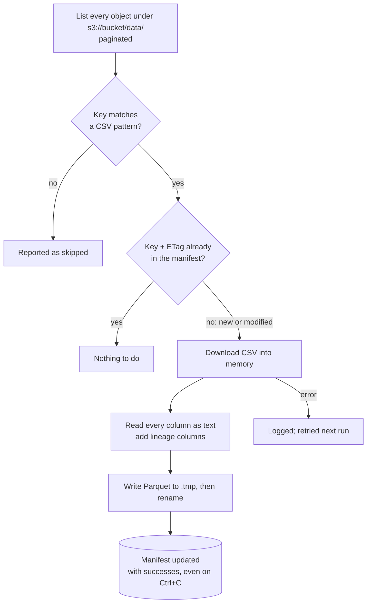

# Bronze design

How the bronze layer works and **why** each decision was made. Next layer:
[`silver_design.md`](silver_design.md).

Code: [`src/bianque/pipeline/bronze.py`](../src/bianque/pipeline/bronze.py),
[`manifest.py`](../src/bianque/pipeline/manifest.py).

## Contents

1. [Running it](#1-running-it)
2. [What a run does](#2-what-a-run-does)
3. [Source and output layout](#3-source-and-output-layout)
4. [Design decisions](#4-design-decisions)
5. [Results on the real data](#5-results-on-the-real-data)
6. [Tests](#6-tests)
7. [Limitations](#7-limitations)

## 1. Running it

```bash
make bronze-plan   # list pending files and MB per dataset; downloads nothing
make bronze        # ingest pending files
uv run python -m bianque.pipeline.bronze --workers 4   # fewer parallel downloads
```

Requires `AWS__BUCKET_NAME` (and credentials) in `.env`, see `.env.example`.

## 2. What a run does



Downloads run in 8 parallel threads with a progress bar in bytes. The run exits with code 1 if
any file failed, so `make pipeline` stops before silver.

## 3. Source and output layout

Source bucket (read-only), 7,671 CSVs, ~5.1 GB:

| Kind | S3 key | Datasets |
|------|--------|----------|
| Facts (daily partitions) | `data/<dataset>/year=YYYY/month=MM/day=DD/<file>.csv` | `transactions`, `digital_events`, `campaign_sends`, `call_center_interactions`, `call_transcripts`, `complaints`, `satisfaction_surveys` |
| Dimensions and references | `data/<dataset>.csv` | `customers`, `products`, `branches`, `service_agents`, `marketing_campaigns`, `daily_exchange_rates` |

Bronze mirrors it, one Parquet per CSV:

```
data/
├── _meta/manifest.parquet                                  # what was ingested
└── bronze/
    ├── transactions/year=2026/month=06/day=17/<file>.parquet
    └── customers/customers.parquet
```

Every row gets three lineage columns: `_source_key` (S3 key), `_source_etag` (S3 ETag) and
`_ingested_at` (UTC timestamp of the load).

The manifest has one row per ingested object: `key`, `etag`, `size`, `last_modified`,
`dataset`, `partition`, `filename`, `rows`, `bronze_path`, `ingested_at`.

## 4. Design decisions

### 4.1 No local raw copy

**Decision:** each CSV is read from S3 into memory and written straight to Parquet. No CSV is
stored locally (`sync.py` from the initial plan was dropped).

**Why:** S3 is already the raw, immutable, read-only source of truth. A local CSV copy would
store the same 5.1 GB twice and add a second place where data can go stale.

**Trade-off:** re-reading the raw data requires S3 access. Files are small (about 3 MB on
average), so holding one in memory per thread is cheap.

### 4.2 A faithful copy: everything as text

**Decision:** every column is read as text (`dtype="string"`); only empty cells become NULL
(`keep_default_na=False`). Typing happens in silver.

**Why:**

- pandas' default would turn strings like `NA`, `null` or `nan` into NULL and guess a type per
  file, so the same column could be integer in one file and float or text in another.
- Keeping the exact text lets silver see what the source sent: integers written as `701.0`,
  the leaked `"¡Oferta especial en nan!"` subject, both `México` and `Mexico`. Those findings
  would be invisible after an early cast.
- Bronze never fails on a bad value; silver decides what to do with it, under a contract.

### 4.3 Lineage on every row

**Decision:** `_source_key`, `_source_etag`, `_ingested_at` are added to every row.

**Why:** any silver or gold row can be traced to the exact S3 object and load that produced
it. Silver also uses `_ingested_at` as the dedupe tie-break for tables without an update
timestamp (latest ingestion wins).

### 4.4 Incremental and idempotent by ETag

**Decision:** a manifest of `key + ETag` decides what to ingest: objects whose key is new or
whose ETag changed. A modified object overwrites its own bronze file.

**Why:**

- The ETag changes whenever an object is re-uploaded, so it detects corrections; listing
  metadata is free, so the check costs no downloads.
- Re-running is safe: with no changes it ingests nothing.
- Overwriting the same bronze path (it mirrors the S3 key) means a corrected file replaces the
  old one instead of creating duplicates.

**Rejected:** `LastModified` alone (does not say whether content changed); a full re-download
every run (5.1 GB each time).

### 4.5 Layout mirrors the source; root files are their own dataset

**Decision:** the bronze path mirrors the S3 key. A file at the root of `data/` becomes a
dataset named after the file (`data/customers.csv` → `bronze/customers/customers.parquet`).

**Why:** a mirrored layout makes lineage obvious and keeps the source's daily partitions. The
first key pattern (from the reference script) only matched `data/<dataset>/.../<file>.csv`;
the dry run showed 6 root files skipped (all dimensions and the exchange rates), so the
pattern was extended.

### 4.6 Discover before downloading

**Decision:** `--dry-run` (`make bronze-plan`) lists pending files and MB per dataset and
every object that does not match the pattern, with its extension.

**Why:** the bucket's real content was unknown at the start. Reporting skipped objects (instead
of ignoring them silently) is how the 6 missing tables were found.

### 4.7 Atomic writes and resumable runs

**Decision:**

- Each Parquet is written to `<file>.tmp` and renamed; the manifest too.
- A failed file is logged and the rest continue; failures are retried on the next run because
  they never enter the manifest.
- The manifest is saved in a `finally` block, so on Ctrl+C the files already written are kept
  and pending downloads are cancelled.

**Why:** a crash or interruption never leaves a half-written Parquet, never loses completed
work, and never marks a failed file as done.

### 4.8 Parallel downloads with a byte progress bar

**Decision:** 8 worker threads (`--workers`), one shared boto3 client, and a progress bar
measured in bytes rather than files.

**Why:** the work is network-bound, so threads overlap the waits; boto3 clients are
thread-safe. File sizes vary a lot between datasets (`digital_events` files are much larger),
so a byte bar shows real progress.

### 4.9 Parquet with zstd

**Decision:** Parquet compressed with zstd.

**Why:** columnar, typed-ready, readable by DuckDB, Athena and Spark; 5.1 GB of CSV became
1.1 GB.

### 4.10 Credentials and configuration

**Decision:** explicit keys from `.env` when present, otherwise boto3's default credential
chain (`~/.aws`, SSO, instance role). Settings are read when the run starts, not at import.

**Why:** works locally and on cloud machines without code changes; secrets never live in code
(`.env` and `.env.*` are git-ignored and gitleaks runs on every commit). Reading settings at
run time lets the module be imported and tested without a `.env`.

## 5. Results on the real data

| Metric | Value |
|--------|------:|
| S3 objects ingested | 7,671 (0 skipped, 0 failed) |
| Datasets | 13 |
| Rows | 23,495,188 |
| Size | 5.1 GB CSV → 1.1 GB Parquet |

Rows per dataset match silver's input (see `silver_design.md` §5); comparison with the data
dictionary's counts is in [`silver_data_findings.md`](silver_data_findings.md) §1.

## 6. Tests

`tests/test_bronze.py` (8 tests, no S3 needed):

- Key pattern matches partitioned facts and root tables; ignores folders, non-CSV objects
  and other prefixes.
- `find_pending` returns only new and modified objects.
- `save_manifest` upserts by key.
- `ingest_one` (with a fake S3 client) keeps values as text, turns empty cells into NULL and
  adds lineage columns.

The late-arrival fixture test (`tests/test_late_arrival.py`) also runs the real `ingest_one`
on local fixture files before silver.

## 7. Limitations

- **Deleted S3 objects stay in bronze.** The source is append-only in practice; a removal
  would need a manual cleanup (silver then detects the missing bronze file and rebuilds).
- **No schema check in bronze.** By design: schema enforcement is silver's job, per contract.
- **UTF-8 is assumed.** All 7,671 files read correctly; another encoding would fail the file
  (logged and retried), not corrupt it silently.
- **One file in memory per thread.** Fine for files of a few MB; very large files would need
  chunked reads.
