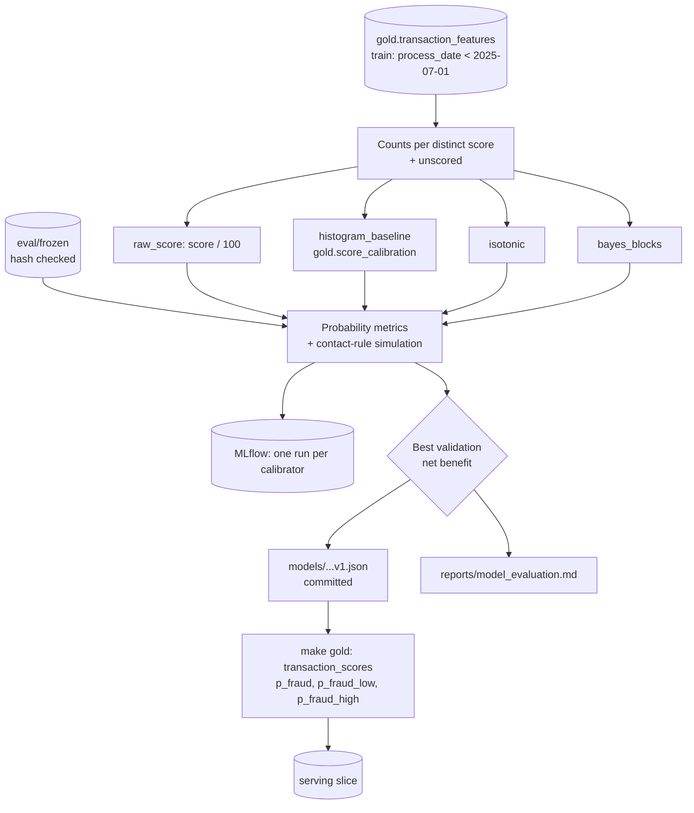

# Model design

How the learned component works and **why**. It sits between gold and the policy: it turns
the bank's `fraud_score` into a calibrated probability with an uncertainty interval, and it
never decides anything. Previous layer: [`gold_design.md`](gold_design.md).

Code: [`models/calibration.py`](../src/bianque/models/calibration.py),
[`models/train.py`](../src/bianque/models/train.py),
[`models/scoring.py`](../src/bianque/models/scoring.py),
[`evaluation/label_signal.py`](../src/bianque/evaluation/label_signal.py). Model file:
[`models/fraud_calibrator_bayes_blocks_v1.json`](../models/fraud_calibrator_bayes_blocks_v1.json).
Results: [`reports/label_signal.md`](../reports/label_signal.md),
[`reports/model_evaluation.md`](../reports/model_evaluation.md).

## Contents

1. [Running it](#1-running-it)
2. [What a run does](#2-what-a-run-does)
3. [Design decisions](#3-design-decisions)
4. [Results](#4-results)
5. [What the policy step must know](#5-what-the-policy-step-must-know)
6. [Tests](#6-tests)
7. [Limitations](#7-limitations)

## 1. Running it

```bash
make label-signal   # signal gate: what is learnable (about 6 min)
make train          # fit, compare on frozen sets, log to MLflow, write model + report (30 s)
make gold           # rescore gold.transaction_scores and the serving slice with the model
uv run --group ml mlflow ui --backend-store-uri sqlite:///mlruns/mlflow.db   # browse runs
```

`make train` needs gold (the frozen sets, `score_calibration` and `channel_costs`). MLflow is
in the `ml` dependency group, so the API image does not carry it.

## 2. What a run does



## 3. Design decisions

### 3.1 A gate before any model

**Decision:** before training, `make label-signal` checks what the data can teach: the score
as a ranker, LightGBM on behavior with a bootstrap interval and a permutation null, Isolation
Forest, a forward-selection step from the score, and the transcript labels.

**Why:** the plan assumed behavioral features carry fraud signal. They do not (PR-AUC at the
base rate, p = 0.38), and the intent classifier fallback had no label either. Training first
would have produced a model at chance with a polished report. Decision record:
[ADR 0001](adr/0001-fraud-signal-gate.md).

### 3.2 The score is at the ceiling, so the model is the score-to-probability map

**Decision:** the learned component is a calibrator of `fraud_score`.

**Why:** legitimate scores never exceed 30.00, so frauds above it are separable, and frauds
below it look exactly like legitimate transactions. The best possible ROC-AUC on scored rows
is 0.834 (validation) and 0.862 (test); the score reaches 0.823 and 0.856. No model can rank
better. What the system still needs is a **probability**: the contact rule multiplies it by
the amount, and a 0–100 score read as a percentage loses USD 238k on validation (§4).

### 3.3 Bayesian blocks: the data places the edges

**Decision:** split the score axis into blocks of constant fraud rate, chosen by maximizing
the Beta-Binomial marginal likelihood minus a penalty per block (optimal partitioning by
dynamic programming, as in Bayesian Blocks). Each block's rate gets a Beta posterior.

**Why:**

- The fixed 5-point histogram of the baseline puts an edge at 30 and mixes the 609
  legitimate transactions at exactly 30.00 with the pure-fraud scores above it: it predicts
  0.24 for 30.01–34.99, where every train transaction is fraud. The blocks put the edge at
  30.00 / 30.01 on their own.
- The posterior gives an interval as well as a mean. The policy needs the interval to
  abstain ("AI should not be autonomous just because it can be").
- Exact and cheap: the Beta prior is conjugate, so there is no sampling (no MCMC), and the
  dynamic program over 4,469 distinct train scores takes under a second.

**Choices inside it:**

| Choice | Value | Why |
|--------|-------|-----|
| Prior | Jeffreys Beta(½, ½) | Uninformative; avoids 0 and 1 in pure blocks |
| Penalty per block | log N (14.9 nats) | BIC-like; set before seeing validation, so validation stays clean for selection |
| Unscored transactions | One more block | 20% of rows, their own fraud rate (0.105%) |
| Interval | 95% equal-tailed | Standard; stored in the model file |

**Rejected:** a finer fixed histogram (where to put the edges is the question, and fixed
edges cannot answer it); isotonic regression as the production model (equal decisions,
slightly worse validation numbers, and no interval); LightGBM on the score (it fits ties and
loses PR-AUC, §4 of the gate report).

### 3.4 Selection on validation, report on test

**Decision:** four calibrators (raw score, histogram baseline, isotonic, Bayesian blocks) are
fitted on train and compared on the frozen sets. The one with the highest **validation** net
benefit (then lowest log loss) is selected. Test numbers are reported and never used to choose.

**Why:** the frozen sets are checked against their committed SHA-256 before use, so every run
and every model is compared on the same rows. Net benefit is the criterion because the
probability exists to drive the contact decision; log loss breaks ties.

### 3.5 The model is a committed JSON file

**Decision:** `make train` writes `models/fraud_calibrator_bayes_blocks_v1.json` (block edges,
counts, prior, penalty, train cutoff); it is committed. `make gold` scores every transaction
from it, through `BayesianBlocksCalibrator` itself, so gold, the API and the evaluation use the
same numbers. Without a model file, gold falls back to the histogram baseline.

**Why:**

- It holds aggregated counts only (no rows, no PII), so it can live in git like the policies.
- It is deterministic (no timestamps): an unchanged retrain leaves git clean, and a changed
  one shows up as a reviewable diff.
- Gold refuses a model trained with a different train cutoff than `settings.yaml`.
- `score_calibration` (the baseline) is still built every run: it is the comparator.

### 3.6 MLflow for runs, git for the model

**Decision:** one MLflow run per calibrator (parameters, validation and test metrics, frozen
set hashes, cost assumptions version, the blocks as an artifact), stored in `mlruns/` with a
SQLite backend (git-ignored).

**Why:** MLflow shows how the candidates compare across runs. The model the system uses is
the committed file, so a fresh clone does not need anyone's `mlruns/`.

## 4. Results

From [`reports/model_evaluation.md`](../reports/model_evaluation.md) (offline; the decision
outcomes are a simulation with synthetic costs):

| Calibrator | Validation log loss | Validation net benefit (USD) | Test log loss | Test net benefit (USD) |
|---|---:|---:|---:|---:|
| raw_score | 0.13733 | −237,514 | 0.13740 | −343,192 |
| histogram_baseline | 0.00384 | 692,234 | 0.00334 | 585,293 |
| isotonic | 0.00376 | 708,283 | 0.00326 | 589,186 |
| **bayes_blocks** | **0.00375** | **714,345** | **0.00325** | **591,159** |
| oracle (contacts only frauds) | | 1,166,149 | | 952,824 |

- Calibration is what makes the score usable: the raw score loses money; any calibrator makes it.
- Bayesian blocks beats the current baseline by USD 22k (validation) and 6k (test), mostly from
  the 30.01–34.99 range the histogram underestimates (its noisier low bins also shift a few
  large-amount contacts). A modest but real gain, in the
  direction the data predicts.
- The gap to the oracle is the frauds no model can see (scores ≤ 30 and unscored).
- Recall is similar across segments, countries and age bands (0.54–0.67 on 36–357 frauds per
  group), and the legitimate contact rate is 0.100–0.101 everywhere (report, last table).

## 5. What the policy step must know

1. **Most legitimate contacts come from a bet on friction.** Below a score of 30 the
   probability is 0.0003, so the expected-value rule contacts only when the amount exceeds
   about USD 6,800 (USD 2,000 when unscored). At the synthetic USD 2 friction that adds 74,673
   legitimate contacts on validation to catch 39 more frauds. Validation sensitivity:

   | Friction (USD) | Contacts | Frauds contacted | Legit contacted |
   |---:|---:|---:|---:|
   | 0.5 | 216,582 | 485 / 699 | 216,097 |
   | 2 | 75,086 | 413 / 699 | 74,673 |
   | 5 | 16,586 | 383 / 699 | 16,203 |
   | 10 | 1,556 | 374 / 699 | 1,182 |
   | 20 | 374 | 374 / 699 | 0 |

   From about USD 10 the rule contacts only the scores above 30.00 (all fraud). The policy
   needs a contact cap, or a minimum probability, rather than relying on one synthetic number.

2. **The 95% interval is narrow, so interval-based abstention catches near-ties.** It
   straddles the break-even only for amounts close to it (16,374 validation transactions, 9
   frauds). There both decisions cost about the same, so sending them to a human costs more
   than it saves. Abstention is more useful for high amounts, repeat complainers and failed
   tools, as the build plan says.

3. **Transactions without a score (20%)** get p = 0.00105 and are never proactive targets
   below about USD 2,000. The reactive path covers them.

## 6. Tests

| File | Covers |
|------|--------|
| `tests/test_calibration.py` | Blocks find a step edge and merge a flat rate; boundary scores go to the right block; interval contains the mean and narrows with data; JSON round trip; isotonic is monotone; baselines |
| `tests/test_train.py` | Expected-value rule outcomes; abstention counting; ECE of a perfect calibrator is 0; selection uses validation, not test |
| `tests/test_gold.py` | Gold scores with the model file (mean and interval per block, unscored block) and refuses a model with a different train cutoff |
| `tests/test_serving.py` | The slice carries the interval columns |

## 7. Limitations

- **One score, one signal.** Nothing in the data improves on `fraud_score`; frauds scored
  ≤ 30 or unscored stay invisible to the proactive path.
- **The simulation assumes a contacted fraud's loss is fully avoided** and uses one SMS per
  contact. The policy step owns channel choice and these assumptions.
- **Net benefit is in assumed USD**, with the synthetic friction of
  `policies/cost_assumptions_v1.yaml`.
- **The penalty (log N) is a convention.** With 2.4M rows in one block and 1,651 in the
  other, any reasonable penalty gives the same two blocks.
- **No drift monitoring yet:** the block rates are stable across years (fraud rate
  0.088–0.102%), but nothing alerts if a new score distribution appears.
