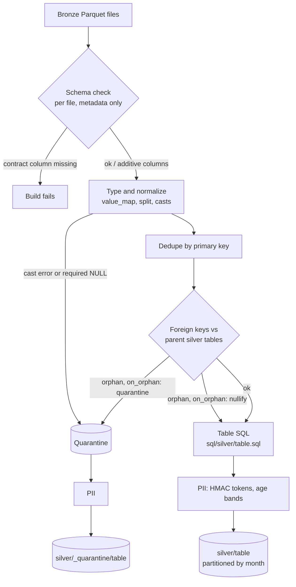

# Silver design

How the silver layer works and **why** each decision was made. Companion documents:

- [`silver_data_findings.md`](silver_data_findings.md): what the bronze data looks like
  (evidence behind the contracts).
- [`../contracts/README.md`](../contracts/README.md): the contract format.

Code: [`src/bianque/pipeline/silver.py`](../src/bianque/pipeline/silver.py),
[`contracts.py`](../src/bianque/pipeline/contracts.py),
[`watermark.py`](../src/bianque/pipeline/watermark.py),
[`sql/silver/`](../sql/silver/).

## Contents

1. [Running it](#1-running-it)
2. [What a run does](#2-what-a-run-does)
3. [Output layout](#3-output-layout)
4. [Design decisions](#4-design-decisions)
5. [Results on the real data](#5-results-on-the-real-data)
6. [Tests](#6-tests)
7. [Limitations and what is left](#7-limitations-and-what-is-left)

## 1. Running it

```bash
make silver                                              # all tables, parents first
uv run python -m bianque.pipeline.silver --table customers   # one or more tables
uv run python -m bianque.pipeline.silver --full              # ignore the watermark
```

Requires bronze (`make bronze`) and `PII_HASH_KEY` in `.env` (see `.env.example`). The key
must stay stable: changing it changes every PII token.

Each table logs one line:

```
transactions  in=70691 quarantined=0 duplicates=0 out=70691 nullified=- mode=incremental ['2026-06']
```

## 2. What a run does

Tables are built in dependency order (a parent before any table whose foreign keys or
`process_day` point to it), computed from the contracts:

```
branches → marketing_campaigns → daily_exchange_rates → customers → service_agents →
campaign_sends → products → call_center_interactions → digital_events → transactions →
call_transcripts → complaints → satisfaction_surveys
```

For each table:



Fact tables first ask the watermark which months to rebuild (section 4.12); dimensions and
the reference table are always rebuilt in full.

## 3. Output layout

```
data/
├── silver/
│   ├── customers/data.parquet                         # dimensions: one file
│   ├── transactions/process_month=2024-01/*.parquet   # facts: one folder per month
│   └── _quarantine/<table>/...                        # only when rows were rejected
└── _meta/silver_state/<table>.json                    # watermark per fact table
```

- `process_month` exists only in the folder name; read with `hive_partitioning = true` to get
  it as a column.
- Facts keep `process_date`; `process_month` is derived from it.
- Every row keeps the bronze lineage: `_source_key`, `_source_etag`, `_ingested_at`.
- Quarantine rows have the same columns plus `_reason` (e.g. `cast:amount; orphan:customer_id`).
- Silver columns = contract columns + derived columns (`amount_usd_source`, `age_band`) +
  additive columns found in bronze, minus PII columns that are replaced (`date_of_birth`).

## 4. Design decisions

Each decision states what was chosen, why, and what was rejected.

### 4.1 Contracts drive everything; SQL is generated

**Decision:** one YAML contract per table is the single source of truth. Silver SQL for typing,
normalization, dedupe, key checks and PII is generated from it. Only table-specific logic is
handwritten, in `sql/silver/<table>.sql`.

**Why:** 13 tables share the same steps; handwritten SQL per table would duplicate them 13
times and drift from the documented schema. The contract is also what quality checks and
documentation read.

**Rejected:** one handwritten SQL file per table (as first planned). Kept only where logic is
truly table-specific (`transactions.sql`), and still portable SQL (Athena/Spark).

### 4.2 Contracts are corrected against the data, not copied from the dictionary

**Decision:** every contract was validated against 100% of bronze rows: columns, allowed values,
`nullable`, structural NULL rules and process-day rules. `value_map` entries exist only for
variants actually observed.

**Why:** the dictionary is wrong in several places (Spanish category values, 100% orphaned
keys, `NOT NULL` columns that are NULL by design). A contract that disagrees with the data
either fails every run or hides real problems. Details: `silver_data_findings.md`.

### 4.3 Typing: reject, do not guess

**Decision:** every cast is a `TRY_CAST`; a value that does not fit is an error, not a NULL.
Integers arrive as floats (`701.0`) and are cast through `DOUBLE`, rejecting real decimals
(`7.5`) instead of rounding them. All errors of a row are collected in `_errors`.

**Why:** silently turning bad values into NULL is indistinguishable from missing data.
Rounding `7.5` to `8` invents a value. Collecting every error (not just the first) makes the
quarantine reason complete.

**Result:** 0 rows with type errors in the real data, so quarantine is exercised by tests.

### 4.4 Schema evolution: additive passes, breaking fails

**Decision:** each bronze file's columns are read from Parquet metadata (no data read). A
contract column missing from any file fails the build, listing the files. A column not in the
contract passes through as text and is logged.

**Why:** a missing column means downstream code would silently get NULLs; failing loudly is
safer. New columns are common and harmless, so they must not block the pipeline. Checking
per file (not the union of all files) catches a single bad file among 1,097.

### 4.5 Quarantine instead of dropping

**Decision:** rejected rows go to `silver/_quarantine/<table>/` with `_reason`, with the same
PII treatment as silver.

**Why:** dropped rows are invisible; quarantined rows can be counted, explained and replayed.
Applying PII there too means raw personal data never lands in silver, not even in rejects.

### 4.6 Dedupe: deterministic, and only where needed

**Decision:** one row per primary key, ordered by the contract's `dedupe_order`
(`last_updated DESC` for customers and products; `_ingested_at DESC, _source_key DESC`
elsewhere). Duplicated keys are found first with a hash aggregation; only those rows go
through the sorting window.

**Why:** the tie-break must be deterministic so two runs produce the same output. Facts have
no update timestamp, so the latest ingestion wins. Sorting 15.6M `digital_events` rows to
dedupe a table with zero duplicates took most of a 12-minute build; skipping the sort for
non-duplicated keys brought it to 1 min 20 s.

### 4.7 Foreign keys: quarantine by default, nullify only with evidence

**Decision:** keys are checked against the parent's silver table (already built, because of
the build order). NULL keys are not orphans. Policy per key:

- `quarantine` (default, 22 keys): the row goes to quarantine with `orphan:<column>`.
- `nullify` (2 keys): the row is kept and the key becomes NULL.

`nullify` is used only for `customers.registration_branch_id` and
`service_agents.assigned_branch_id`, which are random IDs (99.8–100% orphans, unique per row,
5–6 edits from any real branch; see findings §3).

**Why:** quarantining would empty both tables; keeping the random IDs would make an inner join
with `branches` silently drop every customer. A first proposal (keep and flag) was rejected for
that reason.

**Result on real data:** 149,995 and 831 keys nullified; 0 orphans everywhere else.

### 4.8 amount_usd: the source's booking rate, not daily rates

**Decision:** `amount_usd` is NULL for every USD transaction and ~5% of the rest. Silver sets
it to `amount` for USD and fills the rest with the source's fixed booking rate (350 ARS and
4,000 COP per USD), measured from the rows that have `amount_usd`. `amount_usd_source` records
`source`, `usd_amount` or `booking_rate`.

**Why:** the plan was to use `daily_exchange_rates`, but no combination of date, rate column
and direction matched more than 6.2% of source values, while the fixed rate reproduces 99.9%.
Mixing methods would make filled rows differ by up to ±2% from source rows. Decided by the
team after seeing the evidence (findings §8).

**Rejected:** daily rates for NULLs only (two methods in one column); daily rates for all rows
(discards the source's own values).

### 4.9 PII: keyed tokens and age bands

**Decision:**

- `pii.hash` columns (names, document, email, phones, address, product number, IP) become
  HMAC-SHA256 hex tokens keyed with `PII_HASH_KEY`.
- `date_of_birth` is dropped and replaced by `age_band` (`<18`, `18-24`, …, `65+`), computed
  at a fixed reference date (`settings.yaml`, last day of the dataset).
- Free text (transcripts) may contain personal data; it is documented, not tokenized.

**Why:**

- Tokens are deterministic, so joins and counts by these fields still work, but cannot be
  reversed or brute-forced without the key (a plain hash of an email could be).
- DuckDB has `sha256` but no HMAC, so HMAC (RFC 2104) is built in SQL from two `sha256` calls
  with the padded keys computed in Python. It runs vectorized (15.6M IPs in about a minute)
  and is tested against Python's `hmac` module.
- A fixed reference date keeps silver reproducible: age bands do not change between runs.
- Fairness analysis by age needs the band, not the birth date.

### 4.10 Monthly partitions, not daily

**Decision:** facts are partitioned by `process_month=YYYY-MM` (37 folders).

**Why:** daily partitions (mirroring bronze) produced 37,618 files of a few KB for
`campaign_sends` (326 MB, 2 minutes); monthly partitions produce 36 files (62 MB, 26 s). A
month is small enough to rewrite when late data touches it.

### 4.11 Streaming, not materializing

**Decision:** every stage is a view; DuckDB streams from bronze on each pass. Only small sets
are materialized (duplicated keys, quarantine rows). Counts drive whether a pass is needed
(no quarantine pass when there is nothing to quarantine).

**Why:** the machine has 7 GB of RAM. Materializing 15.6M `digital_events` rows twice spilled
8.6 GB to disk and took 12 minutes; streaming uses 2.6 GB and no spill.

### 4.12 Late arrivals: watermark with a trailing window

**Decision:** each fact table keeps a state file with its watermark (highest `process_date` in
silver), a fingerprint (size + mtime) of every bronze file, and a hash of everything that
defines its output. Each run:

1. Finds new or changed bronze files by fingerprint.
2. Rebuilds the months they touch, plus the months covering
   `[watermark − 7 days, watermark]` (`late_arrival_days` in `settings.yaml`).
3. Rows older than the window are still applied (no data loss) but counted and logged.
4. Checks primary-key uniqueness across the whole table; if a key was re-delivered under a
   month that was not rebuilt, rebuilds the table in full.

A full rebuild happens when there is no state, `--full` is passed, bronze files were removed,
or the contract, the table SQL or the silver code changed.

**Why:**

- `process_date` is the source's business day (findings §6); silver never recomputes it, so
  it is a reliable watermark key.
- Rebuilding whole months matches the partition layout and keeps writes simple.
- The window re-checks recent data that commonly gets corrections, even when no file changed.
- Applying (not rejecting) data older than the window avoids silent loss; counting it makes
  late feeds visible.
- Hashing the code closes a gap: without it, a logic change would only reach the window
  months and leave the rest of the table built with the old logic.

**Result:** full build 3 min 07 s; incremental run 40 s (only June 2026: 70k of 4.4M
transactions, 252k of 15.6M digital events).

### 4.13 Atomic writes

**Decision:** output is written to `<name>.tmp` and swapped in only after success; incremental
runs swap one month folder at a time.

**Why:** a failed or interrupted run never leaves a half-written table. The month-by-month swap
is not atomic across months; a crash mid-swap leaves some months new and some old, which the
next run repairs (the state is saved only after success).

### 4.14 Dimensions are always rebuilt

**Decision:** dimensions and the reference table (≤ 400k rows) are rebuilt in full every run.

**Why:** they are snapshots without a partition date, they take seconds, and incremental logic
for them would add complexity for no gain.

## 5. Results on the real data

Full build, 2026-10-03:

| Table | Rows | Quarantined | Duplicates | Nullified keys | Size | Files |
|-------|-----:|------------:|-----------:|---------------:|-----:|------:|
| branches | 350 | 0 | 0 | | 28 KB | 1 |
| marketing_campaigns | 200 | 0 | 0 | | 16 KB | 1 |
| daily_exchange_rates | 13,164 | 0 | 0 | | 136 KB | 1 |
| customers | 150,000 | 0 | 0 | 149,995 | 28 MB | 1 |
| service_agents | 1,200 | 0 | 0 | 831 | 164 KB | 1 |
| products | 400,000 | 0 | 0 | | 30 MB | 1 |
| campaign_sends | 1,746,801 | 0 | 0 | | 57 MB | 36 |
| call_center_interactions | 686,296 | 0 | 0 | | 27 MB | 37 |
| digital_events | 15,620,994 | 0 | 0 | | 526 MB | 37 |
| transactions | 4,425,008 | 0 | 0 | | 213 MB | 37 |
| call_transcripts | 171,321 | 0 | 0 | | 8.6 MB | 37 |
| complaints | 67,095 | 0 | 0 | | 4.2 MB | 37 |
| satisfaction_surveys | 212,759 | 0 | 0 | | 12 MB | 37 |

Silver is 902 MB (bronze 1.1 GB). `transactions.amount_usd` is filled for every row:
1,887,552 from the source, 2,437,979 USD, 99,477 by booking rate.

| Run | Time | Peak memory |
|-----|-----:|------------:|
| Full (13 tables) | 3 min 07 s | 3.5 GB |
| Incremental (trailing window) | 40 s | 1.3 GB |

## 6. Tests

`make test` (64 tests, no S3 or real data needed):

| File | Covers |
|------|--------|
| `tests/test_contracts.py` | All 13 contracts load; build order; nullify policy only on the two branch keys; broken references are rejected |
| `tests/test_silver.py` | Casting and normalization; schema enforcement; quarantine; dedupe; FK quarantine and nullify; table SQL; HMAC vs Python `hmac`; age bands; PII removed from silver and quarantine; partial month writes; watermark end to end; code changes force a rebuild |
| `tests/test_watermark.py` | Full-rebuild triggers; window planning across month boundaries; late rows counted; state round trip |
| `tests/test_late_arrival.py` | Team fixture `fixtures/late_arrival_v2/` through bronze and silver with the real contracts: late partition, duplicate and new column (see `fixtures/README.md`) |

## 7. Limitations and what is left

- **Quality checks run after silver, not inside it.** `allowed`, `range`, `null_when` and
  `process_day` do not reject rows in silver; the quality step (`make quality`,
  `quality/checks.py`) checks every one of them on the built tables and writes
  [`reports/data_quality.md`](../reports/data_quality.md).
- **Parent changes in incremental runs.** If a dimension loses a key, fact months outside the
  rebuilt window are not re-checked against it until the next full rebuild.
- **Free-text PII** in transcripts is not tokenized.
- **Quarantine rows with an unreadable `process_date`** land in `process_month=NULL` and are
  only refreshed by full rebuilds.
- **Fingerprints use size and mtime**, not content: a bronze file rewritten with identical
  size and timestamp would be missed (bronze always rewrites with a new timestamp).
- **Gold assertions** for the late-arrival fixture are added when gold exists.
